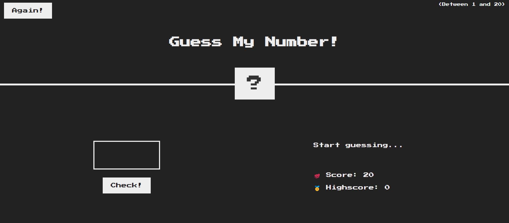

## Project Description

In this project, I aimed to create a web application with the following features:

#### Number Guessing Game:

- The application generates a random number that the user tries to guess.
- In each iteration, the app provides feedback to the user, guiding them to guess a higher or lower number to reach the target number.

#### Technologies Used:

1. HTML: Used for structuring the content of the web page.
2. CSS: Applied for styling the web page and creating a visually appealing user interface.
3. JavaScript: Utilized for implementing the game logic, interacting with the Document Object Model (DOM), and dynamically updating HTML elements.
4. DOM Manipulation: Leveraged to modify HTML elements based on user interactions.
